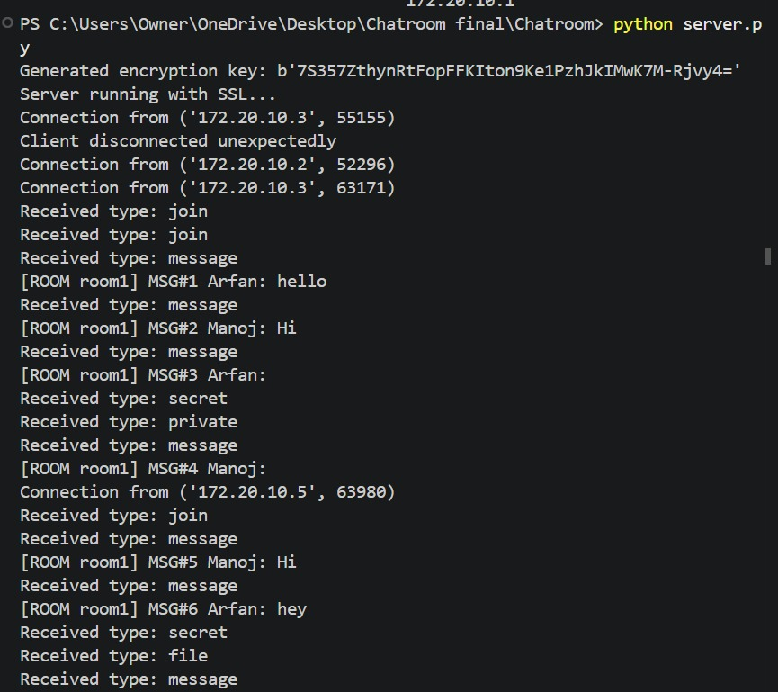
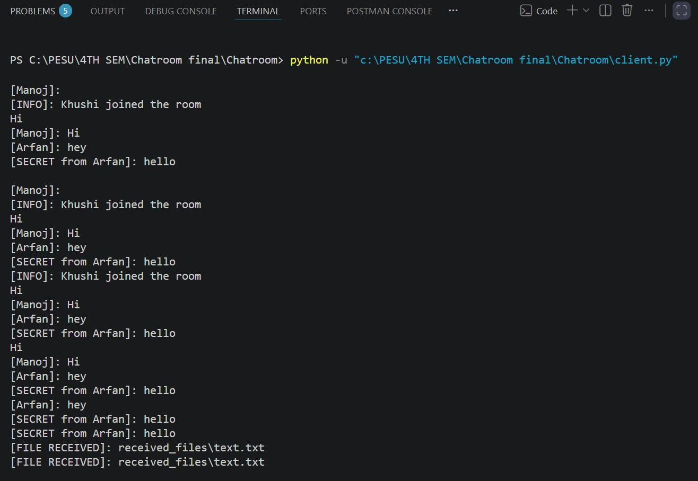
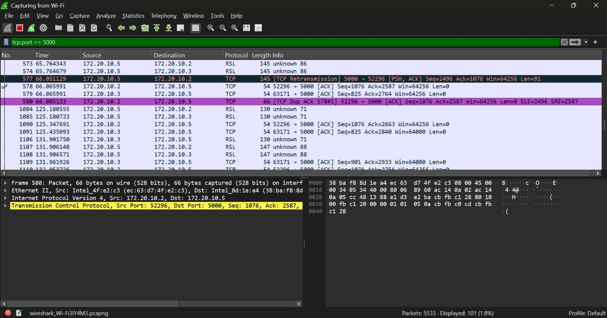
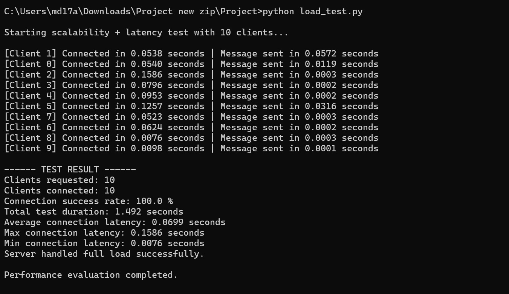
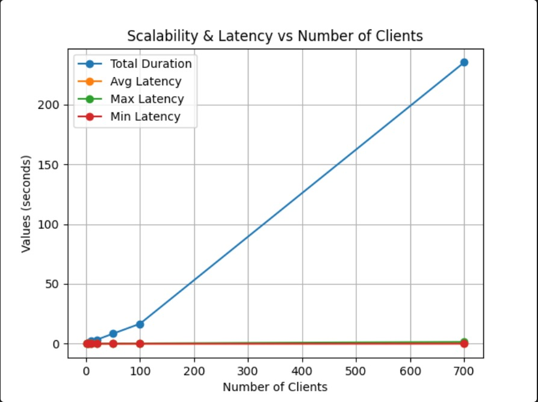

#  Secure Multi-Room Chat System

A secure and scalable multi-client chat application built using Python socket programming.  
The system supports multiple chat rooms, private messaging, encrypted secret messages, file transfer, and SSL/TLS secure communication.

---

#  Overview

This project demonstrates the implementation of:

- TCP Socket Programming
- Multi-threaded client-server communication
- Secure communication using SSL/TLS
- Additional application-layer encryption using Fernet
- Multi-room messaging system
- File transfer between users
- Performance monitoring and scalability testing

The application was developed as an academic networking project and focuses on both functionality and security.

---

#  Features

## Chat Features
- Multi-client support
- Multi-room chat system
- Real-time message broadcasting
- Private messaging between users
- Secret encrypted messaging using Fernet
- Join/leave room notifications

## Security Features
- SSL/TLS encryption for all communication
- Fernet-based encryption for secret messages
- Prevents plaintext packet sniffing
- Secure transmission of files and messages

## 📁 File Transfer Features
- Send files to users in the same room
- Chunk-based file transmission
- Automatically saves received files

## Performance Features
- Handles multiple clients concurrently
- Thread-based architecture
- Custom JSON message framing
- Graceful client disconnection handling
- Load testing and latency monitoring

---

# System Architecture

```text
                ┌───────────────────┐
                │      Server       │
                │  SSL/TLS Enabled  │
                └─────────┬─────────┘
                          │
          ┌───────────────┼───────────────┐
          │               │               │
   ┌──────▼──────┐ ┌──────▼──────┐ ┌──────▼──────┐
   │   Client 1  │ │   Client 2  │ │   Client 3  │
   │ Room: room1 │ │ Room: room1 │ │ Room: room2 │
   └─────────────┘ └─────────────┘ └─────────────┘
```

The server manages all connected clients, rooms, file transfers, and message broadcasting.

---

# Communication Flow

1. Client connects securely to the server using SSL/TLS
2. User joins a room
3. Messages are sent using a custom JSON protocol
4. Server broadcasts messages to all room members
5. Secret messages are encrypted using Fernet
6. Files are transferred in chunks
7. Server maintains room and client information

---

# 📂 Project Structure

```text
project/
│
├── server.py
├── client.py
├── protocol.py
├── encryption_utils.py
├── load_test.py
│
├── cert.pem
├── key.pem
│
├── received_files/
│
├── assets/
│   ├── server.png
│   ├── client.png
│   ├── wireshark.png
│   ├── load_test.png
│   └── optimization.png
│
├── requirements.txt
├── README.md
└── .gitignore
```

---

# Technologies Used

- Python 3.x
- Socket Programming
- SSL/TLS
- threading
- cryptography (Fernet)
- JSON
- Wireshark (for packet analysis)

---

# Setup Instructions

## 1️) Clone the Repository

```bash
git clone https://github.com/BitwiseSage/Secure-Chat-Room.git
cd Secure-Chat-Room
```

---

## 2️) Install Dependencies

```bash
pip install -r requirements.txt
```

Example `requirements.txt`:

```text
cryptography
```

---

## 3️) Generate SSL Certificate and Key

Run the following command:

```bash
openssl req -new -x509 -days 365 -nodes -out cert.pem -keyout key.pem
```

This generates:

- `cert.pem`
- `key.pem`


---

## 4️) Start the Server

```bash
python server.py
```

Expected output:

```text
Generated encryption key: b'...'
Server running with SSL...
```

---

## 5️) Start the Client

```bash
python client.py
```

---

# Available Commands

| Command | Description |
|----------|-------------|
| `hello` | Send normal message |
| `/private username message` | Send private message |
| `/secret username message` | Send encrypted secret message |
| `/file path/to/file.txt` | Send file |
| `/exit` | Disconnect from chat |

Example:

```text
/private Manoj Hi there!
/secret Arfan This is encrypted
/file test.txt
```

---

# Screenshots

## Server Running



---

## Client Chat Interface




---

## Wireshark Packet Capture

This screenshot proves that the communication is encrypted and no plaintext messages are visible.




✔ Only encrypted TLS traffic is visible.

---

# Performance Testing

The server was tested with multiple concurrent clients using `load_test.py`.

## 🔹 Load Test Screenshot




---

## 🔹 Optimization / Scalability Screenshot

The graph the indicates the scalability & Latency after optimization.



---

# Sample Performance Results

```text
Clients requested: 10
Clients connected: 10
Connection success rate: 100.0%

Total test duration: 1.492 seconds
Average connection latency: 0.0699 seconds
Maximum connection latency: 0.1586 seconds
Minimum connection latency: 0.0076 seconds

Server handled full load successfully.
```

---

# Wireshark Security Validation

When the traffic is captured in Wireshark:

- TLS handshake packets are visible
- Chat messages appear as:
  - `TLS Application Data`
- No plaintext chat content is visible

This confirms that SSL/TLS encryption is working correctly.

---


# Learning Outcomes

By building this project, you learn:

- How TCP sockets work
- How to build a client-server architecture
- Multi-threading in Python
- Secure communication with SSL/TLS
- Encryption using Fernet
- Designing custom communication protocols
- Handling multiple clients concurrently
- Debugging network applications using Wireshark

---

# Author

**K R Manoj , Khushi Patel , Mohammed Arfan Asgar**


---

# License

This project is created for academic and educational purposes.

---

# ⭐ If You Like This Project

If you found this project useful, consider giving the repository a star ⭐ on GitHub.